# Smart Ahwa Manager 🇪🇬☕

A Flutter application designed to demonstrate **Object-Oriented Programming (OOP)** and **SOLID principles** through a practical Cairo coffee shop (ahwa) management system.

## 📖 Project Overview

This app allows an ahwa owner to efficiently manage customer orders, track popular items, and generate sales reports. It showcases professional software architecture principles including inheritance, polymorphism, dependency injection, and clean code design.

## 🎯 Features

- ✅ **Order Management**: Add orders with customer names and drink selections
- ✅ **Special Instructions**: Handle extras like "extra mint, ya rais" with pricing
- ✅ **Order Completion**: Mark orders as completed and track workflow
- ✅ **Dashboard**: View pending and completed orders
- ✅ **Sales Reporting**: Generate reports of top-selling drinks and total revenue
- ✅ **Drink Types**: Support for Coffee, Tea, and Hibiscus Tea

## 🏗️ System Architecture & Workflow

### Class Interaction Diagram


### Workflow Sequence Diagram


### Data Flow Architecture

```mermaid
flowchart LR
    subgraph "📋 Models Layer"
        O[Order]
        P[Product]
        E[Extra]
        R[SalesReport]
    end

    subgraph "🔧 Service Layer"
        OM[OrderManagement]
        SG[SalesReportGenerator]
    end

    subgraph "💾 Repository Layer"
        OR[OrderRepository Interface]
        D[Dashboard Implementation]
    end

    subgraph "⚡ Helper Layer"
        H[Pure Functions]
    end

    OM --> OR
    SG --> OR
    OR --> D
    SG --> H
    H --> OR

    %% Correct model relationships
    O -.-> P
    P -.-> E
    SG -.-> R
```



## 🔥 OOP Principles Implementation

### 1. **Inheritance** 🧬

**Location**: `/lib/models/product.dart` and `/lib/models/drinks/`

```dart
abstract class Product {
  late double price;
  List<Extra>? extras;
}

class Coffee extends Product { ... }
class Tea extends Product { ... }
class HibiscusTea extends Product { ... }
```

**Benefits**:

- Shared behavior and properties across drink types
- Extensible design for adding new drinks
- Code reusability and maintainability

### 2. **Polymorphism** 🔄

**Location**: Throughout the application where `Product` is used

```dart
// In Order class - any Product type can be used
class Order {
  final Product product; // Can be Coffee, Tea, or HibiscusTea
}

// In sales analysis - treats all drinks uniformly
String drinkType = order.product.runtimeType.toString();
```

**Benefits**:

- Uniform treatment of different drink types
- Runtime type determination for analytics
- Flexible and extensible code

### 3. **Encapsulation** 🔒

**Location**: All model classes

```dart
class Order {
  final String id;                    // Immutable data
  final Product product;              // Protected access
  final String customerName;          // Controlled visibility
  bool isCompleted = false;           // Internal state

  set completeOrder(bool status) {    // Controlled modification
    isCompleted = status;
  }
}
```

**Benefits**:

- Data protection and integrity
- Controlled access to object state
- Clear interface boundaries

### 4. **Composition** 🧩

**Location**: `/lib/models/product.dart` and `/lib/models/extra.dart`

```dart
// Product HAS-A list of Extra objects (composition)
abstract class Product {
  late double price;
  List<Extra>? extras;  // Composition relationship
  Product({this.extras});
}

// Extra is a separate, independent class
class Extra {
  final String name;
  final double price;
  Extra({required this.name, required this.price});
}

// Usage: Building complex objects from simpler ones
Coffee coffee = Coffee(extras: [
  Extra(name: "extra mint", price: 2.0),
  Extra(name: "ya rais special", price: 0.0)
]);
```

**Benefits**:

- **"Has-A" relationship**: Product contains Extra objects but doesn't inherit from them
- **Flexibility**: Can add/remove extras dynamically at runtime
- **Independence**: Extra class exists independently and can be reused
- **Special Instructions**: Perfect for handling "extra mint, ya rais" requirements

### 5. **Abstraction** 🎭

**Location**: `/lib/models/product.dart` and `/lib/repositories/order_repository.dart`

```dart
abstract class Product { ... }           // Hides implementation details
abstract class OrderRepository { ... }   // Defines contract without implementation
```

**Benefits**:

- Hides complex implementation details
- Provides clean, simple interfaces
- Enables multiple implementations

---

## ⚡ SOLID Principles Implementation

### **S** - Single Responsibility Principle ✅

Each class has one clear, focused responsibility:

- **`Order`** (`/lib/models/order.dart`): Manages order data only
- **`OrderManagement`** (`/lib/services/order_management.dart`): Handles order workflow only
- **`SalesReportGenerator`** (`/lib/services/sales_report.dart`): Generates reports only
- **`Dashboard`** (`/lib/services/dashboard.dart`): Manages order storage only

```dart
class OrderManagement {
  // ONLY handles order operations
  void addOrder(Order order) { ... }
  void markOrderAsCompleted(Order order) { ... }
}
```

### **O** - Open/Closed Principle ✅

**Location**: Drink hierarchy

```dart
// Adding new drink types WITHOUT modifying existing code
class TurkishCoffee extends Product {
  TurkishCoffee({super.extras}) {
    price = 25;
  }
}

// Can add new repository implementations without changing services
class DatabaseOrderRepository extends OrderRepository { ... }
```

**Benefits**: Extensible for new drinks and storage mechanisms

### **L** - Liskov Substitution Principle ✅

**Location**: All Product subclasses

```dart
// Any Product subclass can replace the base class seamlessly
Product coffee = Coffee();
Product tea = Tea();
Product hibiscus = HibiscusTea();

// All work identically in OrderPriceCalculator
double price = OrderPriceCalculator.calculatePrice(order);
```

### **I** - Interface Segregation Principle ✅

**Location**: `/lib/repositories/order_repository.dart`

```dart
abstract class OrderRepository {
  List<Order> getCompletedOrders();
  List<Order> getPendingOrders();
  void addOrder(Order order);
  void markOrderAsCompleted(Order order);
}
```

**Benefits**: Clients depend only on methods they actually use

### **D** - Dependency Inversion Principle ✅

**Location**: All service classes

```dart
// High-level class depends on abstraction, not concrete implementation
class SalesReportGenerator {
  final OrderRepository orderRepository; // Depends on interface

  SalesReportGenerator({required this.orderRepository}); // Injected dependency

  SalesReport generateReport() {
    // Uses abstraction, not concrete Dashboard class
    double totalSales = calculateTotalSales(orderRepository);
  }
}
```

**Benefits**:

- Flexible and testable code
- Easy to swap implementations
- Reduced coupling between components

---

## 📁 Project Structure

```
lib/
├── models/                 # Data models (Order, Product, Extra, Report)
│   ├── drinks/            # Concrete drink implementations
│   ├── order.dart         # Order entity with encapsulation
│   ├── product.dart       # Abstract base class
│   └── report.dart        # Sales report model
├── repositories/          # Data access abstractions
│   └── order_repository.dart  # Repository interface
├── services/              # Business logic services
│   ├── dashboard.dart     # Repository implementation
│   ├── order_management.dart  # Order workflow service
│   └── sales_report.dart  # Report generation service
└── helpers/               # Pure utility functions
    ├── calculate_total_sales.dart
    └── get_top_selling_item.dart
```
